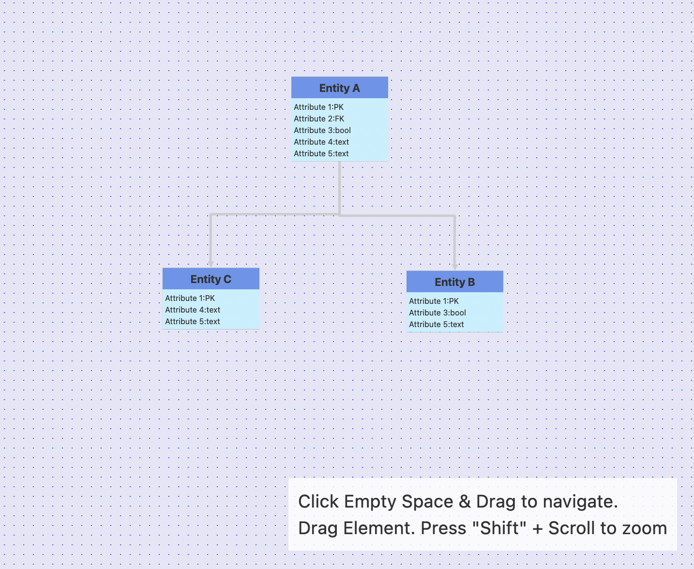

# Cytoscape.js with Angular components

Based on Angular v16 and Cytoscape 3.25.

## Description

A demonstration how to use [Cytoscape.js](https://js.cytoscape.org/) with native Angular components (standalone).

The positioning of the Angular elements is established through a custom core with three tasks:

+ Instantiate an Angular component per node
+ Synchronize the node position wih the component
+ Synchronize component size with the node

The plugin "cytoscapeAngularBridge" is based on the work
of [cytoscape-dom-node](https://github.com/mwri/cytoscape-dom-node) but solves unique Angular challenges.

Things you might want to do before using:

+ Ensure components are destroyed when nodes are removed
+ Provide a way to update the layout after the plugin is activated (currently it's setTimeout workaround)
+ `ngAfterViewInit` to run the first render is my cheap "works for the example solution", ideally you
  involve `OnChanges` etc.

## Preview

